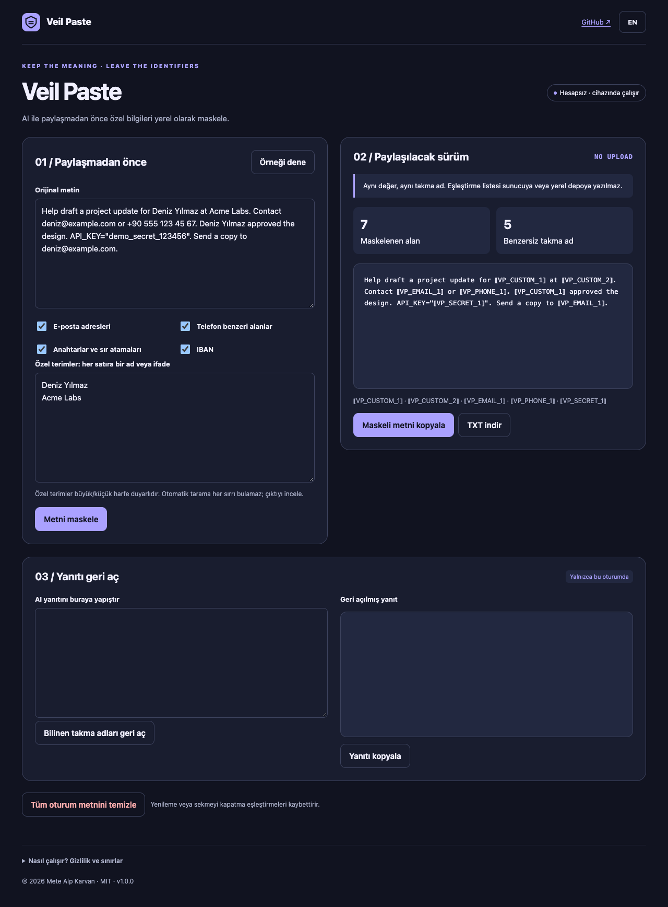

# Veil Paste

Replace private details before sharing text with an AI assistant.

**[Open the app](https://metealpkarvan.github.io/veil-paste/)** · [Türkçe](README.tr.md) · [Download runnable ZIP](https://github.com/metealpkarvan/veil-paste/releases/latest)

## Problem and idea

People want help drafting messages or reports, but their text may contain names, contact details or credentials. Removing them manually loses consistency and makes the answer harder to personalize.

A reversible alias layer: repeated identifiers get the same placeholder, and a reply can be restored using a mapping that exists only in the current tab. The originating X/Twitter observation, access limitations and product inferences are documented in [research notes](docs/RESEARCH.md). This is an independent project, not an endorsed integration.

## Use it

1. Paste the text and choose detection categories.
2. Add private names or project terms, one exact, case-sensitive term per line.
3. Mask and inspect the result. Patterns are suggestions, not exhaustive detection.
4. Copy the masked version into the assistant you choose.
5. Paste its reply into the restore area. Known aliases are restored; unknown aliases remain visible. Reloading discards the mapping.

Switch between Turkish and English. The sample button loads explicitly fictional data. After one successful online load, the service worker caches the app shell for offline reopening in the same browser. Browser support and storage settings vary; export important records.

## Download and run locally

The public demo needs no account or installation. Download **veil-paste-v1.0.0.zip** from Releases, extract it and serve the extracted directory:

    python3 -m http.server 8080 --bind 127.0.0.1

Open http://127.0.0.1:8080. Use a local HTTP server rather than double-clicking index.html; browsers restrict ES modules on file URLs. Release ZIPs contain no credentials or private user records. Verify with the release checksum file:

    shasum -a 256 -c SHA256SUMS.txt

## Privacy and limits

All logic runs in the browser. No AI API, account, analytics, third-party font or remote database. Text is not uploaded. External links open only on user action. Text and mappings live only in the current tab’s memory. Only the language preference may be saved.

Not encryption, anonymization certification or complete DLP. Patterns can miss identifiers or mask innocent numbers. Names require custom terms. Browser extensions, the OS clipboard and a user’s chosen AI service are outside this app’s control.

## Development

    git clone https://github.com/metealpkarvan/veil-paste.git
    cd veil-paste
    npm test
    npm run build
    npm start

Node.js 22+ is needed for tests/build; the app has **zero runtime packages**. Python 3 serves the app. The dist directory is a complete static deployment. GitHub Actions tests Node 22 and 24 and validates before publishing to Pages.

Core checks: Stable repeated aliases, overlapping custom terms, literal restoration, unknown aliases, opt-out categories, credential formats and invalid input limits. Browser acceptance and limitations are recorded in [verification](docs/VERIFICATION.md).

See [architecture](docs/DECISIONS.md), [contributing](CONTRIBUTING.md), [roadmap](docs/ROADMAP.md) and [changelog](CHANGELOG.md).

MIT © 2026 Mete Alp Karvan

## Mac architecture support

The browser app supports both Intel and Apple Silicon Macs through a modern browser. No Rosetta or processor-specific app package is needed. CI runs the rule tests with native Node.js on x86_64 and arm64 macOS runners; browser/device coverage is separate from these checks. The downloaded ZIP contains the same architecture-independent HTML, CSS and JavaScript as the live app.
